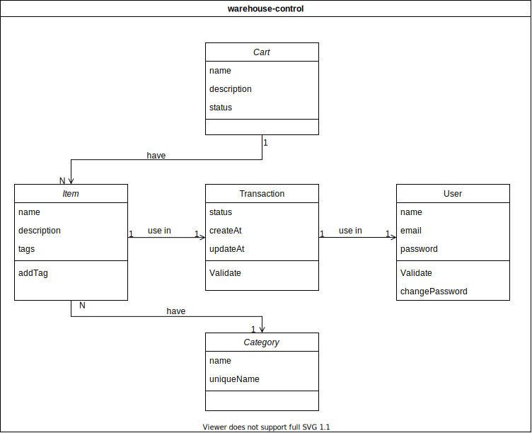

# API de serviço para gerenciamento de estoque

## Descrição

API Backend para transacionar os emprestimos feitos em sistema de backend de aplicação senai

## Estrutura

### Arquitetura

Baseando-se em principio de isolação de arquitetura de software e clean architeture definimos que a aplicação será voltada ao dominio de depositos, desa forma usaremos TDD, BDD e DDD como principios de desenvolvimento

### Layout de pastas

As camadas de pasta implemetarão unica responsabilidade definida pela seguinte estrutura de pastas

```
+-- core
|   +-- entity
+-- adaptors
+-- usecase
+-- infra
|   +-- database
|   |   +-- firebase
|   +-- repositories
+-- shared
|   +-- utils
+-- app
|   +-- http
|   |   +-- controller
|   |   +-- view
```

#### Entidades

`src/core/entity`

São as entidades do sistema que abstraem em um modelo de dados o que faz parte das regras de negócio. São descritas pelo seguinte diagrama



## Requisitos

Para cada funcionalidade e entidade temos a nossa lista de requisitos, ou seja de varacterísticas a serem entregues

### item

- [x] deve ser sempre associado a um storage
- [x] o nome é obrigatório
- [x] não pode exceder um storage
- [x] o storage indicado deve estar disponivél

### storage

- [x] possui um nome obrigatório
- [] pode possuir um storage filho
- [x] um storage não precisa ter itens
- [] possui um status
  - [] ativo
  - [] desativado
  - [] em manutenção

### transação

- [x] possui um item de referência
- [x] possui um usuário de referẽncia
- Retirada
  - [x] não altera a quantidade de itens no storage quando for uma retirada
- Devolução
  - [x] somente quem retirou ou um admin pode devolver o item
- [x] Listar todos as retiradas de um usuário
- [x] listar todas as devoluções recentes de um usuário
- [x] listar todas os items em empréstimo a um usuário (disponiveis para devolver)
- [x] buscar todos os itens disponiveis para a retirada

### Usuário

- [ ] Precisa ter um email
- [ ] Pode ou não ser um admin
- [ ] Precisa de uma senha hasheada

## Requiscão

rota = url, vem a partir da primeira / , rotas são usadas para indicar os paths
path = são caminhos usados para chegar a um recurso
metod = GET, POST, PUT, DELETE
params = são valores inbutidos na url
query = são informacões simples e extras enbutidas depois da virgula -> o query refre-se a valores ão obrigatórios
body = são dados que trarham dentro do cabecário http de forma emcriptada e só funcionam em metodo post ou get
